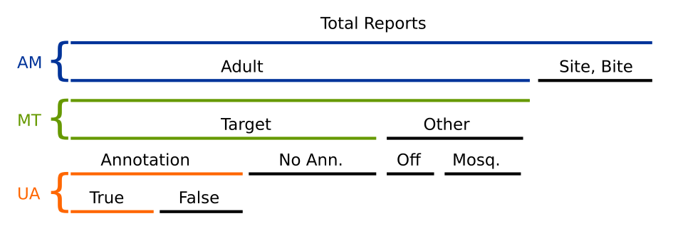
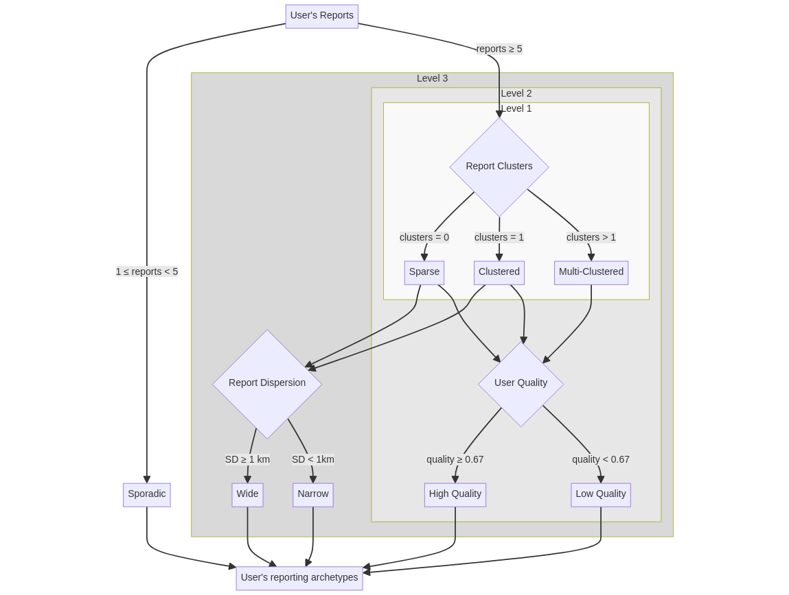

# Methods

To capture the essence of user behavior, we employ a two-step approach. First, for each MA participant, we conduct a point pattern analysis and assess the reporting quality to derive descriptive feature vectors representing their participation behavior. It is important to note that these feature vectors are time-independent, meaning that all reports uploaded by a given user are considered regardless of the upload time. We assume that user behavior remains consistent over time. However, while an individual user's behavior may be stable, the number of different participants involved can vary over time depending on the communication actions taken. This approach allows us to utilize all available data, providing a robust description of participants' behavior.

Second, using the feature matrix, we compute behavioral archetypes through either supervised or unsupervised clustering. Supervised clustering relies on a set of heuristic, human-comprehensible rules that allow for controlled descriptive detail of archetype labels. Conversely, unsupervised clustering generates archetypes in an entirely autonomous manner.

Once archetype labels are assigned to each validated report, we can display report counts grouped by these labels on a yearly or monthly basis to study participation dynamics. Our primary interest lies in understanding when different user archetypes contribute to MA, rather than accounting for behavior changes of individual users over time. Since each user is assigned only one behavioral archetype, it is straightforward to perform the analysis across different administrative areas. Below, we provide a detailed description of the feature vectors and clustering methods used to derive these archetypes.

## Feature Vectors

### Report Dispersion

Report dispersion serves as a proxy indicator of a user's spatial sampling coverage. Each report *i* submitted by a user is geo-located using WGS84 coordinates $(lat_i, lon_i)$. To compute reporting dispersion for a given user, these latitude and longitude coordinates are transformed into UTM coordinates $(x_i, y_i)$. The appropriate UTM zone is selected based on the mean center of the user's reports. This transformation allows distances to be expressed in meters rather than degrees, enabling the use of simple Euclidean metrics.

To estimate report dispersion, we use the standard distance (SD), which is analogous to the conventional definition of standard deviation for a dataset. This measure indicates how spread out the user's reports are around their mean center $(x_m, y_m)$.

$$SD = \sqrt{\frac{ \sum_{i=1}^{n} (x_i - x_m)^2 }{n} + \frac{ \sum_{i=1}^{n} (y_i - y_m)^2 }{n}}$$

### Report Clusters

In point pattern analysis (PPA), three major types of point patterns are recognized: regular, random, and clustered. Regular patterns are excluded from our analysis, as it is assumed that MA participants do not report in a highly organized and systematic manner. We utilize DBSCAN ( Density-Based Spatial Clustering of Applications with Noise), a density-based, to identify clusters among user's report-points. DBSCAN determines the optimal number of clusters and identifies outliers or noise points. If all points are classified as noisy, the sample reflects a random point pattern, suggesting a *Sparse* user reporting behavior. Conversely, if a minority of points are identified as outliers, the sampling behavior is categorized as *Clustered* or *Multi-Clustered*. 

Clustering analysis is restricted to users who have contributed at least 10 reports, as smaller sample sizes are considered statistically unreliable. In our application of DBSCAN, the algorithm is configured with a minimum of 10 points in a neighborhood for a point to be considered a core point, and the maximum distance between two points for one to be considered in the neighborhood of the other ($\epsilon$) is fixed at 100 meters.

### User Quality

This index comprises three simple metrics that collectively assess a user's reporting quality over their participation period:

* **Adult-Mosquito Ratio (AM):** The ratio of expert-validated adult mosquito reports to the total number of reports (adults, bites, and breeding sites) submitted by a user.

* **Target-Mosquito Ratio (TM)**: The proportion of target-mosquito reports relative to the total number of mosquito reports submitted by a user.

* **User-Accuracy (UA)**: A positive, truncated, chance-adjusted accuracy metric derived from Scott's Pi (π), measuring the agreement between a participant's reports and final expert validations. Experts are assumed to provide gold-standard evaluations. Since π ranges from -1 to 1, negative values are truncated to zero, defining UA within a range of 0 to 1.

The **User Quality (UQ)** index ranges between 0 and 1 and is computed as the harmonic mean of AM and TM, adjusted by UA:

$$UQ = \frac{1}{2}\left(\frac{2\times AM \times TM}{AM + TM} + UA\right)$$

The use of harmonic mean penalizes users that tend to send mosquito-adult reports with few or no target-mosquitoes while users that supply reports with accurate taxonomy annotations take a bonus score.

<figure >
    
    <figcaption><b>Figure 1</b>: Reporting quality indexes of a user.</figcaption>
</figure>

In the context of the MA project, the primary goal is to monitor the spread and presence of target mosquitoes. It is assumed that reports concerning bites and breeding sites require less effort from users compared to reports on adult mosquitoes. Given that users can upload any picture to MA, including off-topic or non-target mosquitoes, the specificity of reporting must also be considered to avoid rewarding users who submit numerous reports of low-quality content.

Furthermore, reports on adult mosquitoes allow users to annotate visible taxonomy features such as the thorax, legs, and abdomen, which can help infer the species. If a user's annotations frequently align with expert validations, it is reasonable to assume that their reporting effort and quality are high.

## Derivation of Behavioral Archetypes

### Heuristic-Based Decision Tree

Below is the decision diagram used to construct behavioral archetype labels based on feature vectors at different levels of description:

* **Level 1**: This level considers the spatial clustering of reports. If a user has contributed more than 10 reports, their reporting behavior can be labeled as *Sparse* if the reports are randomly distributed, *Clustered* if the reports are densely aggregated in a single location, or *Multi-Clustered* if the reports are densely aggregated in multiple locations.

* **Level 2**: This level adds a quality dimension to the labels from *Level 1*. A user is labeled as either *High Quality* or *Low Quality* based on whether the UQ index is above or below a threshold value of 0.67.

* **Level 3**: This level further refines the labels for *Sparse* and *Clustered* users by considering the dispersion of reports. Users are labeled as either *Wide* or *Narrow* based on whether their report dispersion exceeds or falls below a threshold value of 1 km. Notably, users classified as multi-clustered may exhibit widely dispersed cluster centroids with significant void space between them, potentially yielding a large SD. This scenario challenges the assumption of homogenous point distribution inherent in standard SD calculations, suggesting that relying solely on SD may not reliably characterize a small yet critical segment of users. For this reason, SD is exclusively applied to *Sparse* and *Clustered* categories, excluding *Multi-Clustered* users, avoiding an excessive number of archetypes.

Users that contribute with less then 10 reports are labeled as *Sporadic* and are not evaluated within any PPA or report quality assessment, as the sample size is statistically insufficient.

<figure >
    
    <figcaption><b>Figure 2</b>: Heuristic-Based decision tree for user reporting archetype labeling.</figcaption>
</figure>

### Unsupervised Classification

Agglomerative clustering with average linkage distance and five fixed clusters is applied to a precomputed distance matrix derived from the feature matrix. The distance matrix is based on the Gower distance, incorporating the logarithm of the standard distance, the Level-1 cluster archetype (i.e., *Sparse*, *Clustered*, and *Multi-Clustered*), and the UQ index. Since the first two features are discrete and only UQ is continuous, the Gower distance helps to deal with data points that have mixed types of variables. It normalizes each feature's contribution to ensure a balanced distance calculation, making it suitable for datasets with diverse feature types.

Once the five clusters are identified, we manually assign archetype labels based on a detailed examination of the clusters' feature distributions. This process involves creating box-plots for each feature within each cluster, allowing us to visually inspect the central tendencies and variances of the features. By analyzing these box-plots, we can discern distinct patterns and characteristics within each cluster, facilitating the assignment of meaningful and descriptive archetype labels. 

<figure >
    
    <figcaption><b>Figure 3</b>: Unsupervised classification for user reporting archetype labeling.</figcaption>
</figure>

