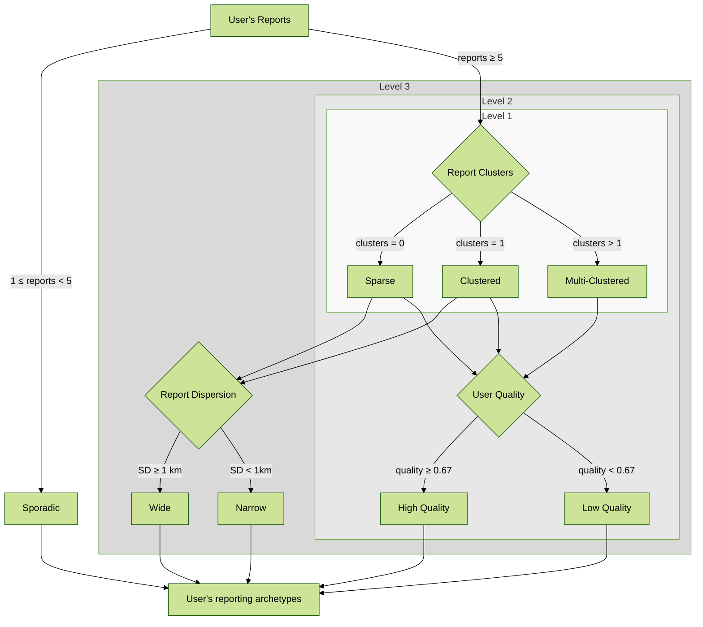
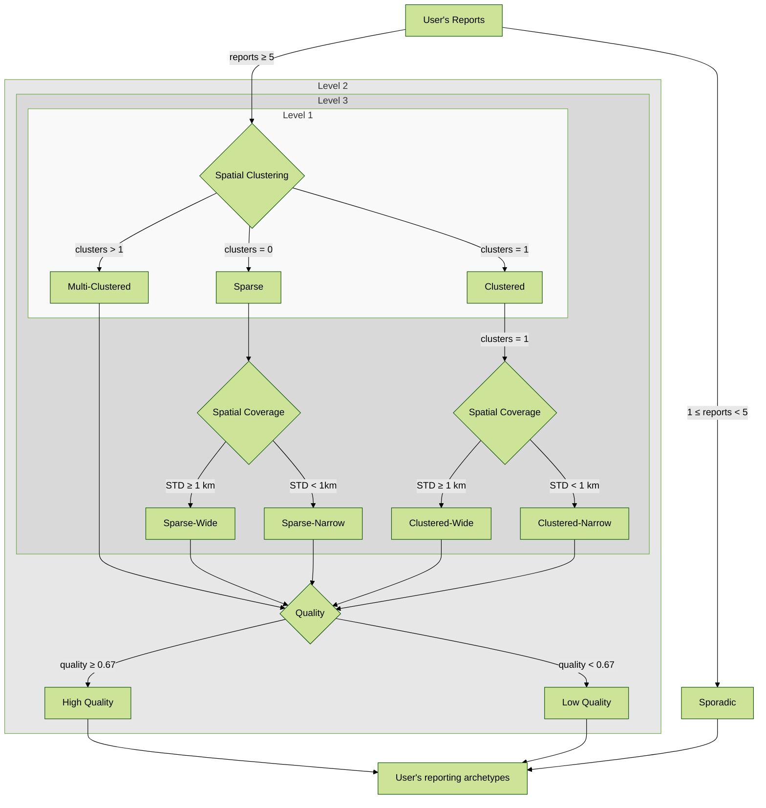
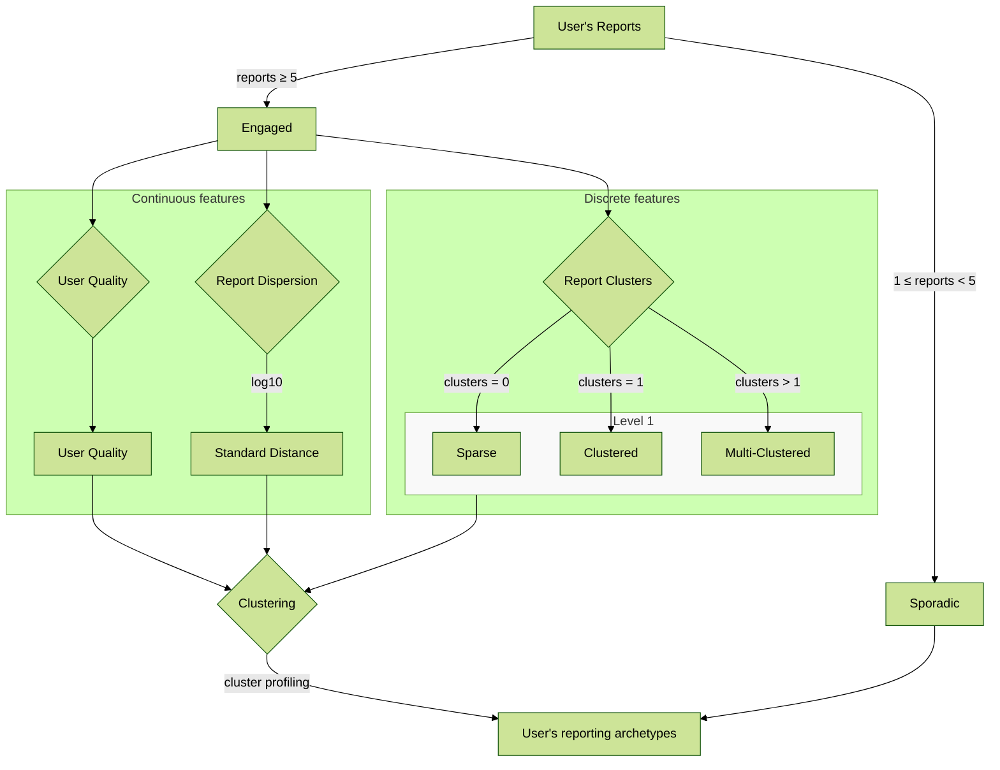

```mermaid
%%{init: {'theme':'forest'}}%%
graph TD
    Start[User's Reports] -->|1 ≤ reports < 5| Sporadic
    Start -->|reports ≥ 5| Clustering{Report Clusters}
    Clustered --> Check_std{Report Dispersion}
    Sparse --> Check_std
    Clustering -->|clusters = 0| Sparse
    Clustering -->|clusters = 1| Clustered
    Clustering -->|clusters > 1| Multi_clustered[Multi-Clustered]
    Multi_clustered --> Check_quality{User Quality}
    Sparse --> Check_quality
    Clustered --> Check_quality
    Check_quality -->|quality ≥ 0.67| HQ
    Check_quality -->|quality < 0.67| LQ
    Check_std -->|SD ≥ 1 km| Wide
    Check_std -->|SD < 1km| Narrow
    Wide --> Stop
    Narrow --> Stop
 
    HQ[High Quality] --> Stop[User's reporting archetypes]
    LQ[Low Quality] --> Stop
    Sporadic --> Stop
    subgraph Level_1[Level 1]
        Clustering
        Sparse
        Clustered
        Multi_clustered
    end
    subgraph Level_2[Level 2]
        Level_1
        Check_quality
        HQ
        LQ
    end
    subgraph Level_3[Level 3]
        Level_2
        Check_std
        Narrow
        Wide
    end

    style Level_1 fill:#f9f9f9ff
    style Level_2 fill:#e7e7e7ff
    style Level_3 fill:#d9d9d9ff
```

```mermaid
%%{init: {'theme':'forest'}}%%
graph TD
    Start[User's Reports] -->|1 ≤ reports < 5| Sporadic
    Start -->|reports ≥ 5| Check_n_clusters{Spatial Clustering}
    Check_n_clusters -->|clusters = 0| Sparse
    Sparse --> Check_std_0{Spatial Coverage}
    Check_n_clusters -->|clusters = 1| Clustered
    Clustered --> |clusters = 1| Check_std_1{Spatial Coverage}
    Check_n_clusters -->|clusters > 1| Multi_clustered[Multi-Clustered]
    Check_std_0 -->|STD ≥ 1 km| Sparse_wide[Sparse-Wide]
    Check_std_0 -->|STD < 1km| Sparse_narrow[Sparse-Narrow]
    Check_std_1 -->|STD ≥ 1 km| Clustered_wide[Clustered-Wide]
    Check_std_1 -->|STD < 1 km| Clustered_narrow[Clustered-Narrow]
    Multi_clustered --> Check_quality{Quality}
    Sparse_wide --> Check_quality
    Sparse_narrow --> Check_quality
    Clustered_wide --> Check_quality
    Clustered_narrow --> Check_quality
    Check_quality -->|quality ≥ 0.67| HQ
    Check_quality -->|quality < 0.67| LQ
    HQ[High Quality] --> Stop[User's reporting archetypes]
    LQ[Low Quality] --> Stop
    Sporadic --> Stop
    subgraph Level_1[Level 1]

        Check_n_clusters
        Sparse
        Clustered
        Multi_clustered
    end
    subgraph Level_3[Level 3]
        Level_1
        Check_std_0
        Check_std_1
        Sparse_narrow
        Sparse_wide
        Clustered_narrow
        Clustered_wide
    end
    subgraph Level_2[Level 2]
        Level_3
        Check_quality
        HQ
        LQ
    end
    style Level_1 fill:#f9f9f9ff
    style Level_2 fill:#e7e7e7ff
    style Level_3 fill:#d9d9d9ff
```

```mermaid
%%{init: {'theme':'forest'}}%%
graph TD
    Start[User's Reports] -->|1 ≤ reports < 5| Sporadic
    Start -->|reports ≥ 5| Engaged
    Engaged --> Clustering{Report Clusters}
    Engaged --> Check_std{Report Dispersion}
    Engaged --> Check_quality{User Quality}

  
    Clustering -->|clusters = 0| Sparse
    Clustering -->|clusters = 1| Clustered
    Clustering -->|clusters > 1| Multi_clustered[Multi-Clustered]

 
    Check_quality --> UQ[User Quality]
    Check_std -->|log10| logSD[Standard Distance]
    
    UQ --> Agglomerative_clustering
    logSD --> Agglomerative_clustering
    Level_1 --> Agglomerative_clustering

    Agglomerative_clustering{Clustering} -->|cluster profiling| Stop[User's reporting archetypes]
    Sporadic --> Stop

    subgraph Discrete[Discrete features]
        Level_1
        Clustering
    end
    subgraph Continuous[Continuous features]
        Check_quality
        Check_std
        UQ
        logSD
    end
    subgraph Level_1[Level 1]
        Sparse
        Clustered
        Multi_clustered
    end

style Level_1 fill:#f9f9f9ff
```
